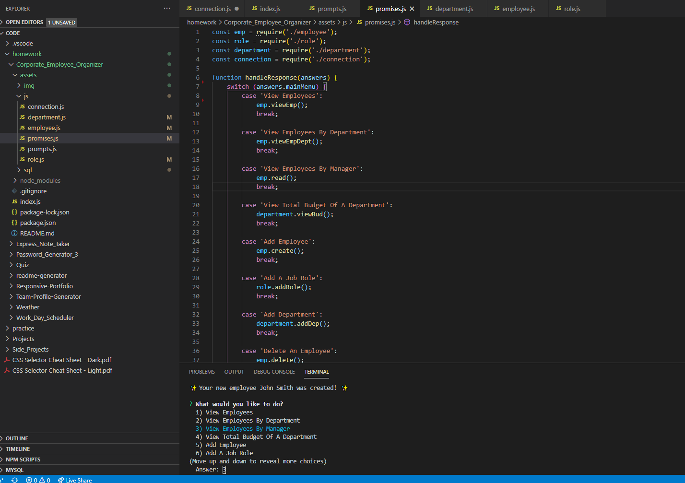

# 🏙 Welcome to Corporate_Employee_Tracker 🏙

> This app was created to simply manage employees for a company, no matter how large it is.  This app is run through node.js.  Since this is run through node.js, this app cannot be deployed on a url.  Please click on the images to see the functionality.

## Install

Please run an npm install to install the files in the package.json file.  When all dependies are installed, simply run node index.js and the command line will allow you to choose from a list of functions to create, edit and modify information for an employee.

## Usage

This app is used to keep all your employees organized for a company.  You can add, update and delete departments, roles and employee information.  All information will store in a database, there are 2 sql files that will setup and add seed data to your database.

## Author

👤 **Vincent Doria Jr.**

* GitHub: [@Cenzo-cmd](https://github.com/Cenzo-cmd)

